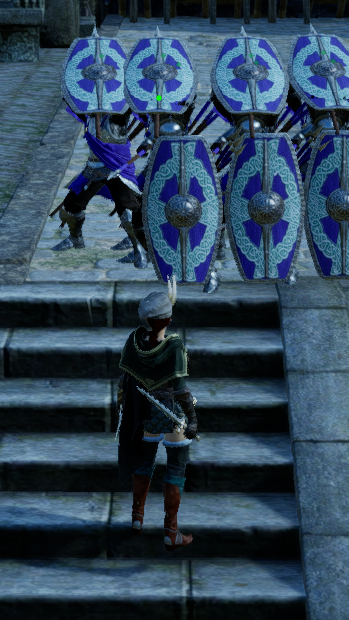
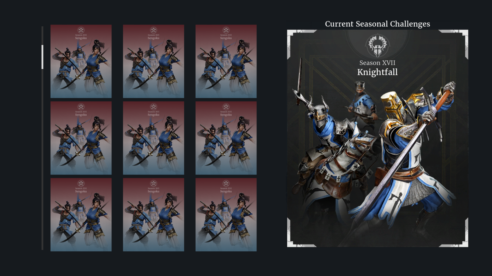

# A Collection of Feedback Directed at the Developers of Conqueror's Blade
*By HQRegent, A.K.A: Union Hamster, Yume no Yuki, Yuki de Yumi, BuffCavArchers*

*Furthermore, buff Mounted Archers.*

- [A Collection of Feedback Directed at the Developers of Conqueror's Blade](#a-collection-of-feedback-directed-at-the-developers-of-conquerors-blade)
  - [Properly Sort Shieldwall Units](#properly-sort-shieldwall-units)
  - [Make Mounted Archers Useful, Please](#make-mounted-archers-useful-please)
    - [Khorchins:](#khorchins)
    - [Khevtuul:](#khevtuul)
  - [Display ALL Unit Data in Barracks Unit Details](#display-all-unit-data-in-barracks-unit-details)
  - [Improve Seasonal Unit Menu](#improve-seasonal-unit-menu)
  - [Display ALL Ability Cooldowns for 2-Weapon Units](#display-all-ability-cooldowns-for-2-weapon-units)
  - [Add Visual Feedback for Support Points and Leadership](#add-visual-feedback-for-support-points-and-leadership)
  - [Adjust Font Sizing \& Color in Doctrine Info (Alchemy \& War Scholar)](#adjust-font-sizing--color-in-doctrine-info-alchemy--war-scholar)
  - [Display Remaining Leadership Value in Leaderboard](#display-remaining-leadership-value-in-leaderboard)
  - [Add Capacity % for Supply Dump Items (Volume: N)](#add-capacity--for-supply-dump-items-volume-n)
  - [Remove "OK" Popup Confirmation (modals)](#remove-ok-popup-confirmation-modals)
  - [Clarify Imp Jav Shield Throw Abilities](#clarify-imp-jav-shield-throw-abilities)

----

## Properly Sort Shieldwall Units

**Problem**:
Shieldwalls units often do not sort themselves reasonably. In the example PRG have enough units to make 15 pairs of low-high shields, and yet on each end there is a sole high-position shield. A similar issue often appears when forming the other hybrid spear, Maidens; they'll often double-up and have a pair of high-high or low-low position shields.

**Solution**:
Shieldwallers should sort into consistent pairs every time. if there is an uneven model count, the unpaired models should all take the low/kneeled stance



---

*All feedback from this point was originally posted in the official MyGames Discord prior to their relenquishing of publishing rights. Each post has been modified slightly remove repeated text and to be better formatted.*

## Make Mounted Archers Useful, Please

Of the 5 (?) Mounted bow units (rattan are crossbows and outriders are javelinists but lets include them anyway), essentially only outriders see and are of any use. The other's, even after reworks, are basically not worth their leadership once the blue-lock is over. Khevtuul and rangers are prime examples of this since they require non-insignificant effor to obtain. Rangers had issues in the past with their power and I don't envy anyone who needs to balance chu-ko-nu, but even ignoring them entirely leaves 3 incredibly unique units essentially as wasted barracks slots. 
Mounted archers shine brightest against infantry and are faster than their armored melee counterparts, yet even in field battles or sieges with wide open 2nd points they aren't seen much (with the exception of outriders)

My post is too long so ill split the change suggestions into messages on this thread

- Ironcap bowriders: I feel these are more or less fine
- Outriders: I feel these are more or less fine
- rattan rangers: I won't lie I don't even attempt to use these ~~cuz i never bothered to unlock them~~ so others would be better at giving suggestions

Key takeaway:
Ranged is always hard to balance in every game, but in a world where charging 20 Cataphracts or wing'ed hussars through an 8-foot-wide door is a valid strategy I'm sure we can give the units which took over Eurasia multiple times some love.

### Khorchins:

- Their encircling ability, `Hunt`, is so situational it might as well not exist
- They are described as fast, harrasment units with light armor but are slower than either melee cav of the same season (please lmk if the in-game numbers are inacurrate)
- Some possible changes off the top of my head:
  - increase their speed
  - replace `Hunt` with an ability which acts as a more linear upgrade to `Precision Volley`
    1. run to a targeted area at some increased speed until enemy units are in range
    2. loose their armor-piercing arrows for some N seconds or until the same button is pressed again
    3. the unit returns to the Hero, e.g. cover commander, while loosing arrows when in range

### Khevtuul: 

IMO one of the coolest *ideas* for a unit in the entire game || not as cool as longbows, Welsh/Briton fans rise! ||
- Too squishy to effectively enter melee combat against any purple invantry IME
- Their current ability `Spreading Flame` is cool in theory but unwieldy in practice
  - It seems like the best way to use this is to actively try and avoid they unit going into melee by aiming off to the side or otherwise bugging their pathing
- Some changes focused on giving the unit more flexibilty
  - Allow manual weapon swapping, idk why this isn't already in the game...
  - Allow the unit to fire arrows outside of abilities
  - Give an armor bonus when in swords are in use
  - Increase the duration of the immilating effect or replace/add the stunning CC from Bow's `Bodkin Arrow`
    - this will give the unit a better chance to be effective in melee despite it's weak armor
  - Split `Spreading Flame` into multiple stages
    1. `Flank & Poke`: The unit moves towards a targeted location, loosing flaming arrows at enemies in range
    2. Give 2 options after the ranged ability
    2a. `Rally to Commander`: Unit runs back to the Hero with the typical cover-commander speed bonus
    2b. `Charge`: Unit swaps to swords then follows a directed charge
    - `Charge` chould be moved to an independent ability, but this idea retains the "bow ability leads to sword ability" identity of the initial designs


## Display ALL Unit Data in Barracks Unit Details

This has always been a gripe of, I assume, everyone who plays the game. Why is there so much info hidden/missing from the UI? It's just frustrating and confusing.
Some examples of data which is either not well detailed or just outright non-existent:
```yaml
- "Unit Orders" (i.e. abilities)
    - cooldowns are not shown
    - secondary effects are often missing numerical data (see: Shield Maiden Weapon Swap)
- "Unit Traits" are wildly inconsistent in what level of detail they give. 
    - some give actual numerical changes (see: Battle Madness)
    - some are meaningless (see: Bodkin Arrow, Javelineers, Melee Masters)
    - some are not well explained (see: Heavy Javelins)
    - (personally I think the seasonal unit traits are also meaningless but they're whatever)
- Ranged accuracy is not displayed anywhere afaik
    - should show % chance to hit or some meaningful explination of how accuracy is handled
    - subsequently: "Sharpshooters" Unit Trait would be removed or at least now be somewhat meaningful
- Block & Block Dmg/Break Values are shown nowhere
    - which means all nodes or doctrines that affect block are all affecting a mystery magic number
- Ranged rate of fire
- Musket reload speed
```
I'm sure I've missed something so please let me know if I should add to the list. 


## Improve Seasonal Unit Menu

With the number of seasons ever increasing, a click-drag side-scroll becomes more and more *and more* painful to interact with. This should've changed a while ago. I suggest it change to a grid which can actually be quickly moved through (see the attached mockup). It would be even better if the option (permanent setting!) was added to change from a grid to a list which hides most of the banner art so more seasons can be seen without scrolling. Simple QoL improvement.




## Display ALL Ability Cooldowns for 2-Weapon Units

Feedback: Conditional unit commands are difficult to keep track of, e.g. Shield Maiden's charge cooldown should be visible while in wielding spears. I understand the initial thought process behind hiding inaccessible abilities, but it is not worth the decrease in information on display.

Possible Solution: Units display all their abilities at all times. Inaccessible abilities (weapon-dependent, rage-dependent, etc.) are greyed out or have some demarcation to show they cannot be used at that time. For 2-weapon units, the abilities for the weapon not in use could simply be added in a row above the current weapon's abilities.


## Add Visual Feedback for Support Points and Leadership

Feedback: A key issue with Support Points is the lack of any immediate feedback. Aside from buff/debuff status icons and healing numbers, there is no visual, "empirical", and immediate feedback for how support points are gained while in battle. 

Solution: I propose the addition of text-based UI for gained support points while the game is actually being played out.
It could be placed either in the same location as the Unit-Kills-count UI (when you kill an enemy soldier) or just below it. I beleive this change alone would notably increase the number of players using support abilities and units || even if 100% increase from 1% is only 2% ||.

TLDR: Add in-match UI for Support Points gained in the same manner as unit-kills. Visual feedback heavily implied importance and support is important!


## Adjust Font Sizing & Color in Doctrine Info (Alchemy & War Scholar)

Feedback: The font visual hierarchy in doctrine info, for some reason I must assume is accidental, prioritizes the generic "A Doctrine is an enhance..." blurb over the actual doctrine info. 

Simple Solution: swap which text box has which text.


## Display Remaining Leadership Value in Leaderboard

Replace the remaiing troop count with remaining leadership value, since it is a more accurate representation of the strength of either side's forces. You could also replace the dead troop count with this, since it serves little purpose -- dead hero count is similarly not useful.  You could keep the existing information as a tooltip (i.e. hover-able) or, as with the hero count, display a fraction.

The new team-statistics could look something akin to:
```yaml
Leadership  Troops   Heroes 
   800     500/1000   12/15

(replace the words with the icons in game)
```
You could also have the leadership be a fraction/ratio for the positive/negative visual feedback


## Add Capacity % for Supply Dump Items (Volume: N)

Feedback: The Supply Dump UI is overwhelming and difficult to manage

(Partial) Solution: Add Capacity usage % for individual items and/or item stacks so players can get have clear and digestible information instead of massive, unsorted strings of digits. The Volume digit doesn't even need to be removed, since there is space in the list element to add the %


## Remove "OK" Popup Confirmation (modals)

Forced Modal (popup) confirmation boxes are a waste of the user's time. Make it a non-focused notification so we don't have to spam OK all the time. These modals are all over the place in the game...


## Clarify Imp Jav Shield Throw Abilities

Feedback: The Imperial Jav mastery has given them a new ability: Shield Throw.... or wait? does this improve the shield throw that already exists? or add a new passive ability? or the same passive ability without going down that vet line? or....

> They also have different ranges, different damage types, different damage amounts, different multi-hit, different animations and speeds. 
> There is not a single meaningful similarity beyond the name
> 
> *- CasualScrub*

Solution: Either rename the new ability or add clarification to both the mastery-unlocked ability and the vet line passive. I hope this is just another classic translation issue or someting because adding these descriptions to the game and somehow not seeing how confusing it will be is kinda funny 

